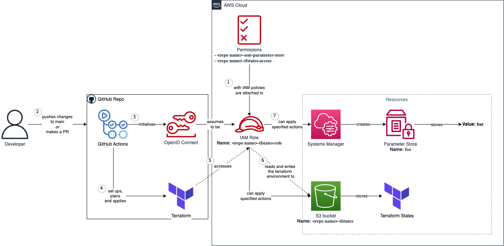

# About

A CI/CD pipeline where where `.tfstate` files are saved on an S3 bucket and updated at every GitHub push/PR using GitHub Actions.

# Set up the CI/CD pipeline
1. Design your AWS infrastructure.
2. Code the infrastructure using Terraform. I named my file `main.tf`.
3. Create an S3 bucket. This will be later used to store the terraform state.
4. Launch AWS IAM and create 2 policies:
- [to read and write the S3 bucket that we created in step 1.](./docs/AWS%20IAM%20policies/s3-policy.json)
- [to read and write other AWS tools that will be used by our `main.tf` file.](./docs/AWS%20IAM%20policies/other-aws-tools-policy.json)
5. Create a new IAM role and attach the  policies we created.
6. Create a GitHub Actions file. This will connect to your IAM role using OpenID Connect protocol and run your terraform code. You can copy the file in [`./github/workflows/main.yml`](./.github/workflows/main.yml)
7. Launch the GitHub repo to create our GitHub Action secrets. Go to `Settings > Secrets and variables > Actions`. Create 4 new repo secrets:
- `AWS_ROLE`: ARN value of the role that we created in step 5.
- `AWS_BUCKET_NAME`: Name of the S3 bucket that we created in step 3.
- `AWS_REGION`: Region of the S3 bucket that we created in step 3.
- `AWS_BUCKET_KEY_NAME`: Name of the terraform state file that will be created in the S3 bucket. I named mine `infra.tfstate`.
8. Stage files and commit. Either:
- push to main branch
- make a new PR request and merge it
9. GitHub Actions will start running. Wait until it finishes. Hopefully no errors will be produced. If you get any errors, create a new issue in this repo.

# Destroy terraform resources
1. Delete everything in `main.tf`.
2. Push committed changed to remote repo.

# Notes
1. [Video explanation of the infrastructure](https://www.youtube.com/watch?v=GowFk_5Rx_I)